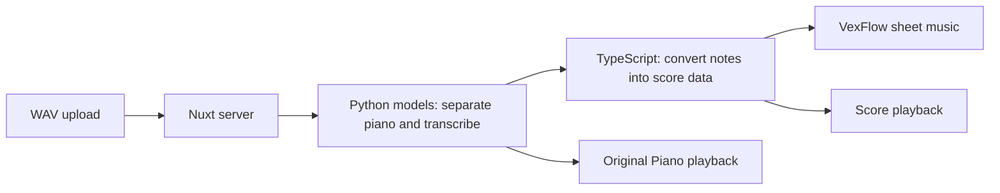

# Piano Accompaniment Studio

Turn a WAV recording into a piano accompaniment score. Preview the audio, play the score, and export it as PDF.

## Quick Start (Docker)

Install and start Docker with Docker Compose. You also need [downloaded model files](docs/development.md#models); model setup is not automated. No OpenAI API key is needed.

1. Put the models in `.audio-score-models/` at the project root.
2. Run:

   ```bash
   docker compose up --build -d
   ```

Open [http://localhost:3200/](http://localhost:3200/), choose a WAV file, then select **Transcribe**. Copy `.env.example` to `.env` only if you need a different model directory or port.

To stop:

```bash
docker compose down
```

## Background

Many piano learners can play from sheet music but struggle to learn songs by ear. Identifying chords and arranging an accompaniment that sounds like the original takes substantial effort, which can make learners give up. This project aims to make that experience accessible without requiring those skills.

## Goal

Let users specify a song title and artist, then have the application find the song and turn it into piano sheet music. Users should not need to prepare screenshots or recordings themselves.

## Features

- Upload a WAV file up to 100 MB and follow transcription progress.
- Preview the selected recording before uploading.
- View the piano score and export it as PDF.
- Play the score or the separated piano audio (**Original Piano**), with seeking and tempo control.
- Cancel transcription or reconnect after refreshing while the server remains running.

## Local Development

Install Node.js, npm, ffmpeg, and the [Python runtime and models](docs/development.md#local-python-runtime). From the project root, run:

```bash
npm install
npm run dev -- --port 3200
```

Open [http://localhost:3200/](http://localhost:3200/). Press `Ctrl+C` to stop. See the [development guide](docs/development.md) for command-line transcription and Docker logs.

## Testing

```bash
npm test
npm run typecheck
npm run test:e2e
```

`npm test` runs unit and component tests. E2E tests use stubbed transcription responses, not real models. Stop any service on port 3200 before running E2E tests.

See the [test inventory](docs/test-inventory.html) for coverage.

## Architecture



Nuxt serves the website and starts the Python models. TypeScript prepares the notation and playback data. Docker runs these together on CPU.

**Stack:** Nuxt 3, Vue 3, TypeScript, Python, ffmpeg, Zod, VexFlow, Web Audio API, Vitest, and Playwright.

## Limitations

- One recording is processed at a time. Additional requests are rejected rather than queued.
- Transcription can misidentify notes, repeated strikes, and sustain. Note editing is not available yet.
- Jobs time out after 30 minutes. Restarting the server clears the job list; previous jobs no longer open in the website.
- Uploads, results, and logs are not automatically deleted. See [data storage](docs/development.md#docker-data-and-logs).
- This is a local, single-server MVP without user authentication or cross-device job history. Docker exposes the website only on localhost.
- Score playback loads piano samples from an external CDN.
