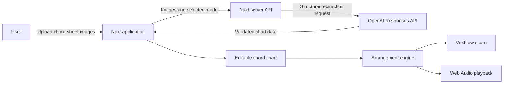

# Piano Accompaniment Studio

Piano Accompaniment Studio uses AI to create editable, playable piano accompaniment scores.

## Background

Many songs are available only as guitar chord-sheet images. Converting them into piano accompaniment requires transcription, music theory, and arrangement work. This project uses AI to extract the chart, lets the user correct the result, and generates a simple score that can be played or exported.

## Goal

The goal is to let users name a song, describe the accompaniment they want in natural language, and receive a piano score they can edit, play, and export without arranging it manually.

## Current MVP

The current MVP starts from chord-sheet images. AI extracts the song structure, chords, beat durations, and lyrics; the user corrects the result before the application generates a simple piano accompaniment score.

## Features

- Upload one or more chord-sheet images and choose an OpenAI model for chart extraction.
- Review and edit chords, beat durations, lyrics, and measures before generating a score.
- Add, delete, and reorder chords or measures with undo and redo support.
- Generate a piano score, adjust playback tempo, seek through the arrangement, and export it as PDF.
- Restore the current workspace from browser session storage.

## Current Architecture



The server sends uploaded images to the OpenAI Responses API and validates the structured result with Zod. The browser editor is the source of truth after extraction, so users can correct recognition errors before arrangement generation. The arrangement engine converts confirmed four-beat measures into deterministic piano events used by both score rendering and playback.

**Stack:** Nuxt 3, Vue 3, TypeScript, OpenAI Responses API, Zod, VexFlow, Web Audio API, Vitest, and Playwright.

## Current Design Trade-offs

| Decision | Benefit | Limitation |
| --- | --- | --- |
| AI chart extraction | Reduces manual transcription | Results are non-deterministic and require review |
| Editable intermediate chart | Recognition errors can be fully corrected | Adds a review step before score generation |
| Deterministic arrangement patterns | Produces predictable notation and playback | Provides less musical variation than manual arrangement |
| Browser session storage | Requires no account or database | Work is not synchronized across devices or browser sessions |

## Setup

```bash
npm install
cp .env.example .env
```

Add an OpenAI API key to `.env`:

```dotenv
NUXT_OPENAI_API_KEY=your_api_key
```

Start the development server:

```bash
npm run dev
```

Open the local URL shown by Nuxt. The analysis model is selected in the application.

## Audio-to-score MVP

Run the MVP with one WAV path:

```bash
npm run audio:score -- "/absolute/path/to/recording.wav"
```

The command creates or overwrites `.audio-score/<recording-name>/` beside the WAV file.

Serve the project directory to view and play generated scores:

```bash
npm run audio:score:serve
```

Open `http://127.0.0.1:3200/.audio-score/<recording-name>/index.html`.

Project samples:

```bash
npm run audio:score -- "./安靜.wav"
npm run audio:score -- "./楓.wav"
npm run audio:score:verify
```

## Testing

```bash
npm test
npm run test:e2e
npm run test:e2e:live
```

- `npm test` runs unit and component tests.
- `npm run test:e2e` runs Playwright with a stubbed AI API.
- `npm run test:e2e:live` runs the complete flow against the real OpenAI API and requires `NUXT_OPENAI_API_KEY`.

## Current Limitations

- Chart extraction depends on image quality and model output.
- Generated charts currently use 4/4 time and can be normalized to C major or A minor.
- The arrangement engine is intended for simple MVP accompaniment rather than professional composition.
- Piano playback downloads audio samples from an external CDN.

## Documentation

- [Test inventory](docs/test-inventory.html)
