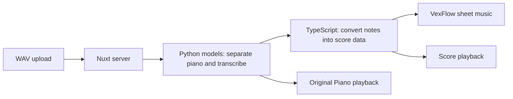

# Piano Accompaniment Studio

Piano Accompaniment Studio uses AI to help users create and play piano accompaniment scores.

## Background

Many piano learners can play from sheet music but struggle to learn songs by ear. Identifying chords and arranging an accompaniment that sounds like the original takes substantial effort, which can make learners give up. This project aims to make that experience accessible without requiring those skills.

## Goal

Let users specify a song title and artist, then have the application find the song and turn it into piano sheet music. Users should not need to prepare screenshots or recordings themselves.

## Current MVP

Choose a WAV recording on the homepage to transcribe it into a piano score.

## Features

- Upload a WAV file up to 100 MB and follow transcription progress.
- Preview the selected recording locally before uploading; clear it with × to choose another file.
- View the piano score and export it as PDF.
- Play the generated score or the separated piano audio (**Original Piano**), with seeking and tempo control.
- Cancel transcription or reconnect after refreshing while the server remains running.

## Current Architecture



Nuxt runs the website and starts the local transcription pipeline. Python models process the recording; TypeScript prepares the notation and playback data.

**Stack:** Nuxt 3, Vue 3, TypeScript, Python, ffmpeg, Zod, VexFlow, Web Audio API, Vitest, and Playwright.

## Setup

Run commands from the project root. Install Node.js and npm, then:

```bash
npm install
```

Audio transcription also requires `ffmpeg` on PATH, a Python virtual environment, and downloaded model files. `npm install` does not install these. No OpenAI API key is needed for audio transcription.

The pipeline expects `venv/` and `models/` inside this runtime directory:

- macOS: `~/Library/Application Support/Piano Accompaniment/audio-score/`
- Linux: `~/.local/share/piano-accompaniment/audio-score/`

Python dependencies are listed in [requirements.txt](scripts/audio-score/requirements.txt). Required model checkpoints and caches are defined in [runtime.ts](shared/audio-transcription/runtime.ts). There is no automated runtime and model installer yet; a fresh clone cannot transcribe until these dependencies are installed.

Start the development server:

```bash
npm run dev -- --port 3200
```

Open [http://localhost:3200/](http://localhost:3200/), choose or drop a WAV file, then select **Transcribe**. Keep the terminal running; press `Ctrl+C` to stop.

The website handles transcription and audio playback. No separate preview server is needed.

## Audio-to-score CLI

These tools are for pipeline development and inspecting generated files, not for starting the website.

```bash
npm run audio:score -- "./recording.wav"
```

This creates or overwrites `.audio-score/recording/` beside the WAV file. To preview that output when the WAV is in the project root, stop the website and run:

```bash
npm run audio:score:serve
```

Open `http://127.0.0.1:3200/.audio-score/recording/index.html`. This server only serves files inside the project directory; outputs beside WAV files elsewhere are not available at that URL.

For local fixture verification, rebuild `安靜.wav` and `楓.wav` from the project root, then run `npm run audio:score:verify`. These recordings are not included in Git.

## Testing

```bash
npm test
npm run typecheck
npm run test:e2e
```

`npm test` runs unit and component tests. E2E tests use stubbed transcription responses; they do not verify the real models. Stop any service on port 3200 before running E2E tests so Playwright can start its test server.

## Current Limitations

- One recording is processed at a time; additional requests are rejected rather than queued.
- Transcription can misidentify notes, repeated strikes, and sustain. Note editing is not available yet.
- Jobs time out after 30 minutes. Restarting the server clears its in-memory job list.
- Uploads, results, and logs remain in `.data/audio-scores/<job-id>/`. They are ignored by Git and are not automatically deleted.
- This is a local, single-server MVP without user authentication or cross-device job history.
- Score playback loads piano samples from an external CDN.

## Documentation

- [Test inventory](docs/test-inventory.html)
